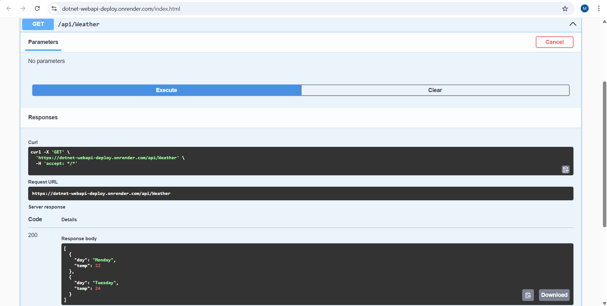
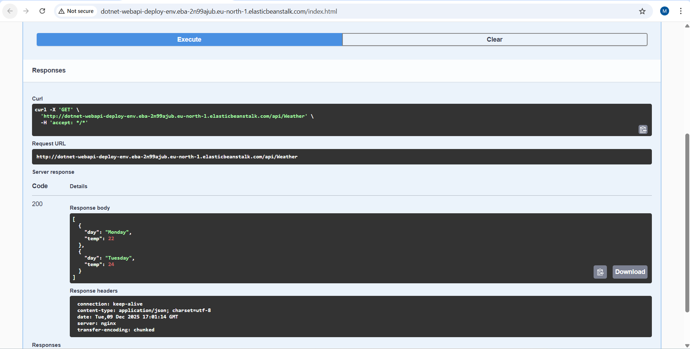
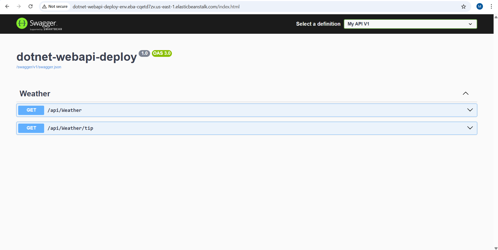

# Dotnet Web API Deploy

This project demonstrates deploying a .NET 8 Web API to Render and AWS Elastic Beanstalk with CI/CD.

## Features
- Minimal API with `/api/Weather` endpoint
- Swagger / OpenAPI enabled for testing the API
- Deployment using Docker on Render
- Deployment on AWS Elastic Beanstalk
- GitHub Actions workflow for build and Render deploy hook (CI/CD)

## Deployment Workflows

### 1. AWS Elastic Beanstalk
The workflow automates deployment to AWS Elastic Beanstalk:

1. Builds the project using `dotnet build`
2. Publishes the project to the `publish` folder (`dotnet publish`)
3. Zips the published output
4. Uploads the zip to S3
5. Creates a new Elastic Beanstalk application version and updates the environment

**Required GitHub Secrets:**
- `AWS_ACCESS_KEY_ID`  
- `AWS_SECRET_ACCESS_KEY`  
- `AWS_REGION`  
- `EB_APPLICATION_NAME`  
- `EB_ENVIRONMENT_NAME`  
- `EB_S3_BUCKET`

> Note: `dotnet restore` is not explicitly called because `dotnet build` / `dotnet publish` restore packages automatically.
> Only pushes to the `aws_elasticbeanstalk_release` branch trigger this workflow.

### 2. Render
The workflow automates deployment to Render on pushes to the `render_release` branch:

1. Checks out the code
2. Sets up .NET SDK
3. Restores packages (`dotnet restore`)
4. Builds the project (`dotnet build`)
5. Triggers Render deployment using the deploy hook

**Required GitHub Secret:**
- `RENDER_DEPLOY_HOOK_URL`

> Only pushes to the `render_release` branch trigger this workflow. Certain paths are ignored to avoid unnecessary deploys (e.g., `.md` files, screenshots, GitHub Actions folder).

## Screenshots

### Render Deployment

### AWS Elastic Beanstalk Deployment

## Notes
- No unit tests; API is verified via endpoint calls
- Free-tier resources used
- CI/CD workflows ensure automatic deployment on commits
